🚀 Frontend Practice Projects
================================
[교육명] 프론트엔드 개발시 꼭 해봐야하는 실무 예제 Part.1

  

## 📋 프로젝트 개요
웹 브라우저의 **데이터 저장, 동적 UI, 사용자 인터랙션** 등 프론트엔드 핵심 기능들을 학습하며 직접 구현한 프로젝트입니다.

 

## 🛠 기술 스택

### Frontend
- HTML5, CSS3, JavaScript (ES6)

### UI Framework
- Bootstrap 4.6.0

 

## 🎯 프로젝트 목록
| No | Project | Path | Description |
|------|--------------------|-----------|------|
| 1 | 🎵 Accordion FAQ Menu | [🔗 보기](./1-accordion-FAQ-menu) | Practice on Accordion UI |
| 2 | 💾 LocalStorage Basic Operations | [🔗 보기](./2-localStorage-basic-operations) | Practice on Local Storage : Save, Load, Delete |
| 3 | 📊 LocalStorage Data Visualization | [🔗 보기](./3-localStorage-viewer) | Practice on LocalStorage Table Viewer |
| 4 | 🔧 Dynamic Table Generation | [🔗 보기](./4-localStorage-addRowColumn) | Practice on Create Row and column Local Storage |
| 5 | 🍪 Cookie Management System | [🔗 보기](./5-cookieControl) | Practice on Cookie Management |
| 6 | 🍪 Advanced Cookie System | [🔗 보기](./6-cookieControl-delete-all) | Practice on Advanced Cookie Management |

 

### 1. 🎵 Accordion FAQ Menu

✅ UI 인터랙션 기능

- 전체 아코디언 바 닫기 버튼 생성
- 클릭으로 FAQ 내용 토글
- hover, click 시 부드러운 CSS 애니메이션 적용
- NodeList 객체와 반복문 활용

 

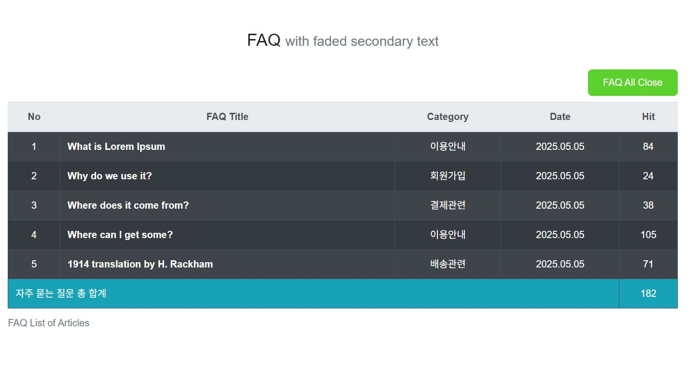

 

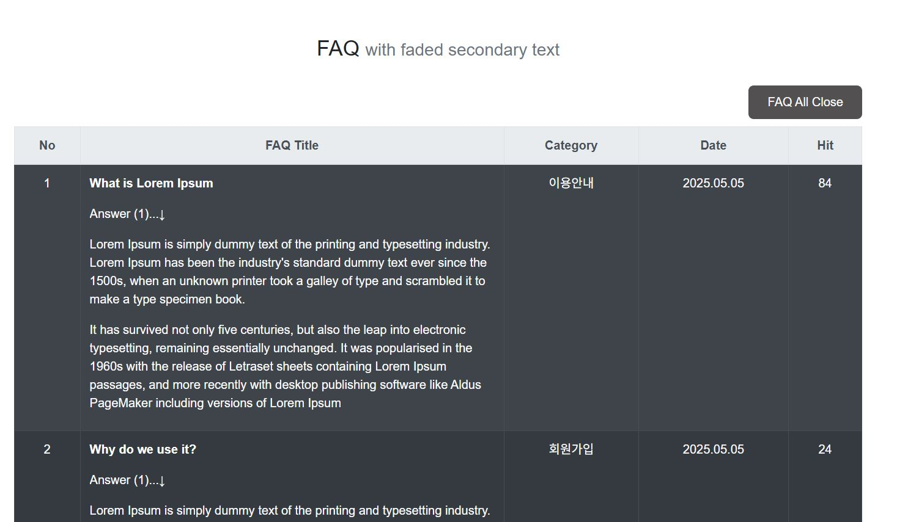

 

### 2. 💾 LocalStorage Basic Operations

✅ 기본 기능

- 데이터 저장/조회/삭제
- 실시간 입력값 처리

 

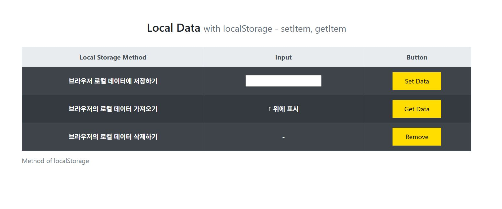

 

 

### 3. 📊 LocalStorage Data Visualization

✅ 고급 기능

- 저장된 모든 데이터 테이블 형태로 출력
- Key-Value 쌍 동적 렌더링
- 배열 데이터 처리 및 반복문 활용

 

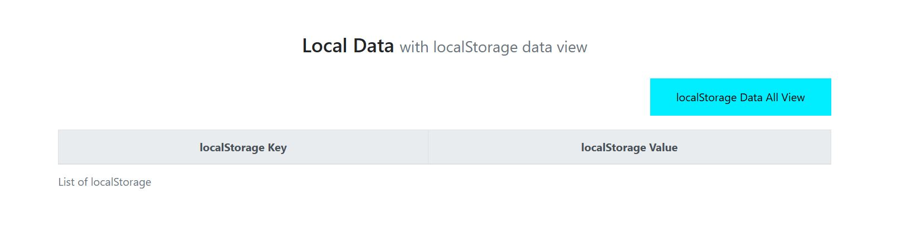

 

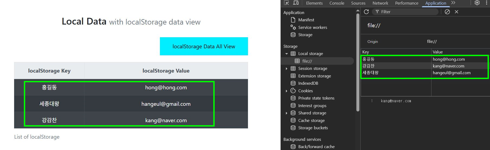

 

### 4. 🔧 Dynamic Table Generation

✅ 주요 기능

- 실시간 행/열 추가
- insertRow(), insertCell() 메서드 활용
- 텍스트 노드 생성 및 삽입

 

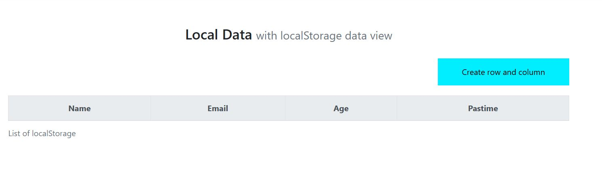

 

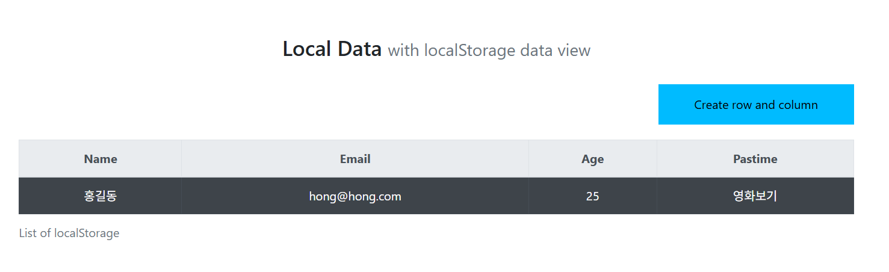

 

+) 행열 번호 출력

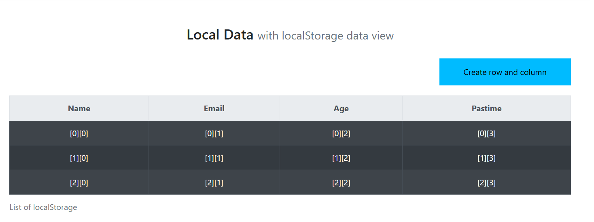

 

### 5. 🍪 Cookie Management System

✅ 주요 기능

* 쿠키 생성/읽기/삭제 기본 기능
* 7일 만료 기간 자동 설정
* 첫 방문자/재방문자 구분 메시지
* UTC 시간 형식 활용

 

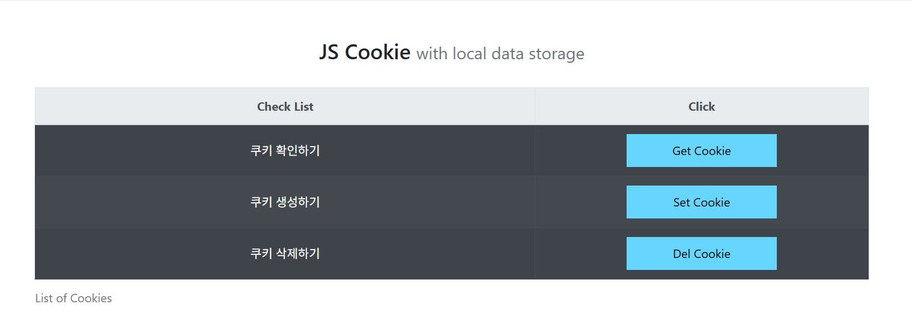

 

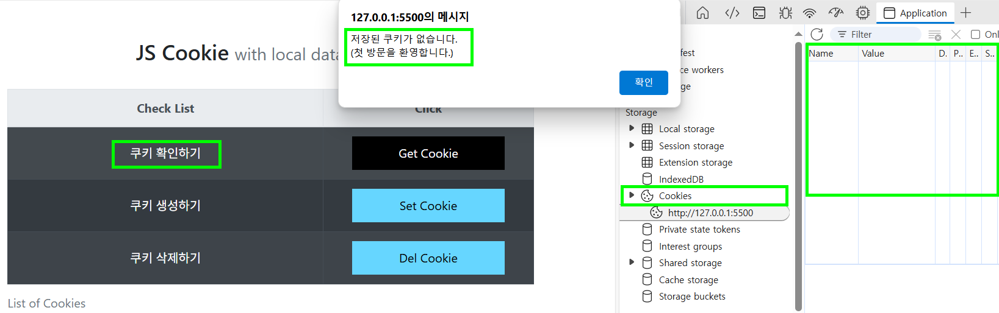

 

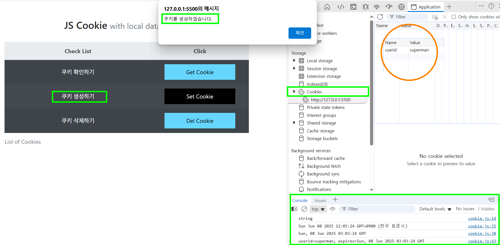

 

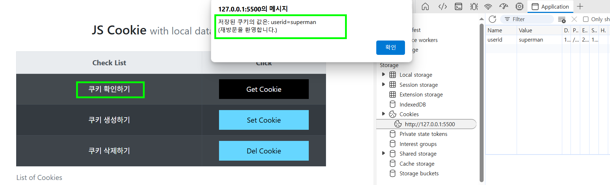

 

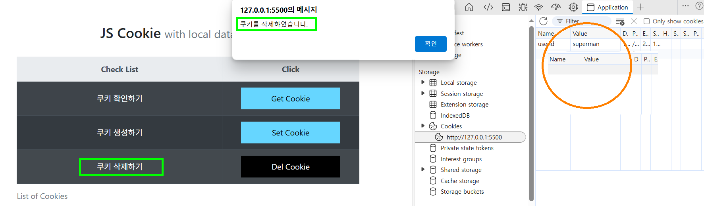

 

### 6. 🍪 Advanced Cookie System

✅ 고급 기능

- 사용자 정의 쿠키 생성 (이름, 값, 만료일 입력)
- 개별 쿠키 삭제
- 전체 쿠키 일괄 삭제 기능
- Form 데이터 검증 및 초기화

 

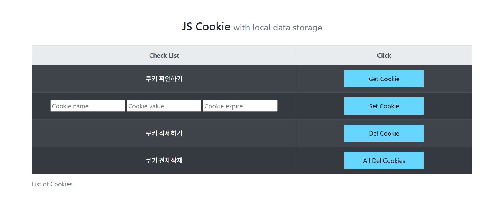

 

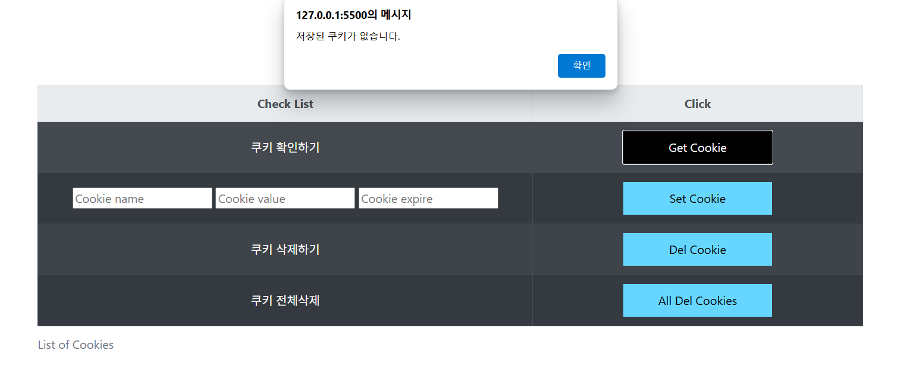

 

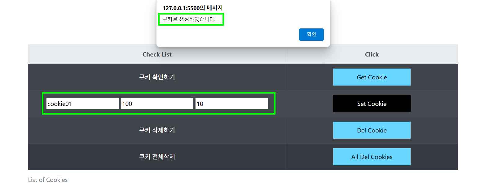

 

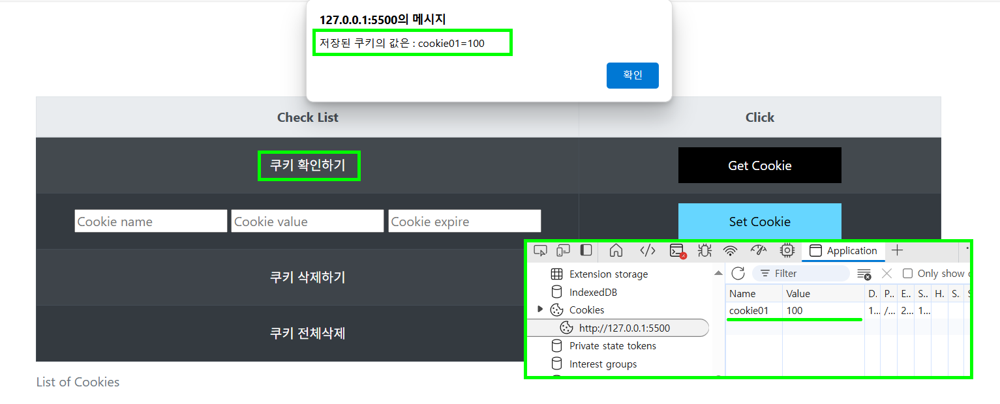

 

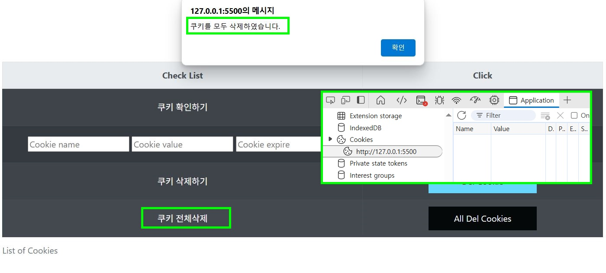

 

## 👤 개발자 노트
프론트엔드 개발 학습으로 브라우저 API부터 동적 UI까지 단계적 학습 완료

